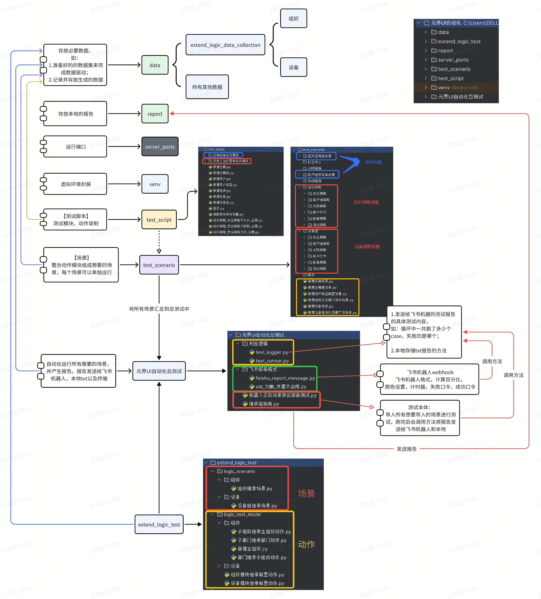

# UI自动化测试框架 v2.0

## 简介
这是一个针对  -> 信界Web UI自动化测试的框架，基于 Playwright + Pytest

自动化设计思路详情参见：
https://asiainfo-sec.feishu.cn/wiki/XTbxwNoYAiplevktz4YcfpUinTb

- #终端启动playwright获取元素脚本,
```bash
playwright codegen http://10.21.20.227:18080/
```
##  环境部署指南
下载python 3.12版本，在pycharm中部署为解释器

### Playwright 安装步骤

1. **打开 PyCharm**
   - 启动您的 PyCharm IDE。

2. **打开终端**
   - 在 PyCharm 底部的工具栏中，找到并点击“Terminal”标签，这将打开一个内置的命令行终端。

3. **输入安装命令**
   - 在打开的终端中，输入以下命令来安装 Playwright Python 库：
     ```bash
     pip install playwright
     ```
   - 等待命令执行完成，这将从 Python 包索引下载并安装 Playwright。

4. **运行 Playwright 的 post-installation 脚本**
   - 安装 Playwright 之后，您需要运行一个额外的脚本来下载所需的浏览器。在同一终端中输入以下命令：
     ```bash
     playwright install
     ```

### 额外提示
- 确保您的 PyCharm 使用的是正确的 Python 解释器，特别是如果您在系统中安装了多个 Python 版本的情况下。您可以在“File” > “Settings” > “Project: [项目名]” > “Python Interpreter”中检查和选择正确的解释器。
- 如果您在安装过程中遇到权限问题（尤其是在 Linux 或 macOS 上），可以尝试使用 `sudo` 前缀来提升权限，例如使用 `sudo pip install playwright`。

### 在 PyCharm 中安装 Requests 库

#### 步骤 1: 打开 PyCharm 终端
1. 打开您的 PyCharm IDE。
2. 在 PyCharm 底部的工具栏中，找到并点击 “Terminal” 标签。这将打开 PyCharm 的内置命令行终端。

#### 步骤 2: 安装 Requests 库
1. 在打开的终端中，输入以下命令来安装 `requests` 库：
   ```bash
   pip install requests
按 Enter 执行命令。这将从 Python 包索引下载并安装 requests 库到您的项目环境中。


##  技术架构
本项目基于以下技术和工具构建，旨在提供高效且可靠的UI自动化测试解决方案：

- **Python**: 版本 3.12
- **Playwright**: 自动化浏览器操作，兼容所有Web浏览器。
- **Pytest**: 作为测试运行器，简化测试编写和执行过程。
- **requests**: requests库


## 架构示意图

参照（https://asiainfo-sec.feishu.cn/docx/QZDvdklJGov9Qwx4ulXc6N1andf?from=from_copylink）



## 使用指南
参照 （https://asiainfo-sec.feishu.cn/wiki/Odnxwtu2AiGi0jklVZKc2dmgnob?from=from_copylink）